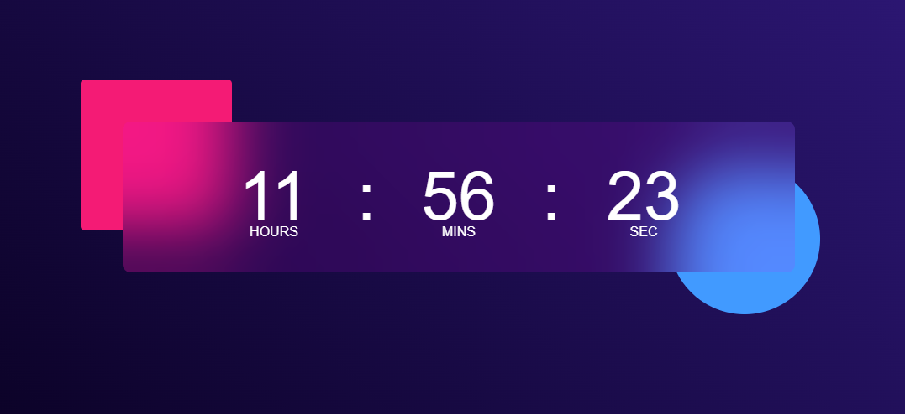

# Digital Clock Project

Welcome to the **Digital Clock Project**! This project demonstrates the implementation of a functional and visually appealing digital clock using web technologies.

## 📜 Features

- 🕒 Displays the current time in **HH:MM:SS** format.
- 📆 Shows the current date (optional).
- 🎨 Customizable themes (light/dark mode or user-specified colors).
- ⏰ Real-time updates with smooth animations.
- 🖥️ Responsive design suitable for all screen sizes.

## 🚀 Technologies Used

- **HTML5**: Structure of the clock.
- **CSS3**: Styling and animations.
- **JavaScript**: Logic for time and date updates.

## 🛠️ Installation & Setup

1. Clone the repository:
   ```bash
   git clone https://github.com/wilfredtinega/digital-clock.git
   ```
2. Navigate to the project directory:
   ```bash
   cd digital-clock
   ```
3. Open the `index.html` file in your browser to view the clock.

## 🎨 How to Customize

- **Colors**: Update the CSS file to modify the color scheme.
- **Font Style**: Change the font-family in the CSS file to apply a new font.
- **Date Display**: Toggle the date visibility by modifying the JavaScript or CSS class.

## 📸 Screenshots


## 🤝 Contributing

Contributions are welcome! If you'd like to improve this project, please:
1. Fork the repository.
2. Create a new branch (`feature/your-feature-name`).
3. Commit your changes.
4. Open a pull request.

## 📨 Contact

Feel free to reach out for feedback or collaboration:
- **Email**: [Wilfred Tinega](mailto:wilfredtinega2@gmail.com)
